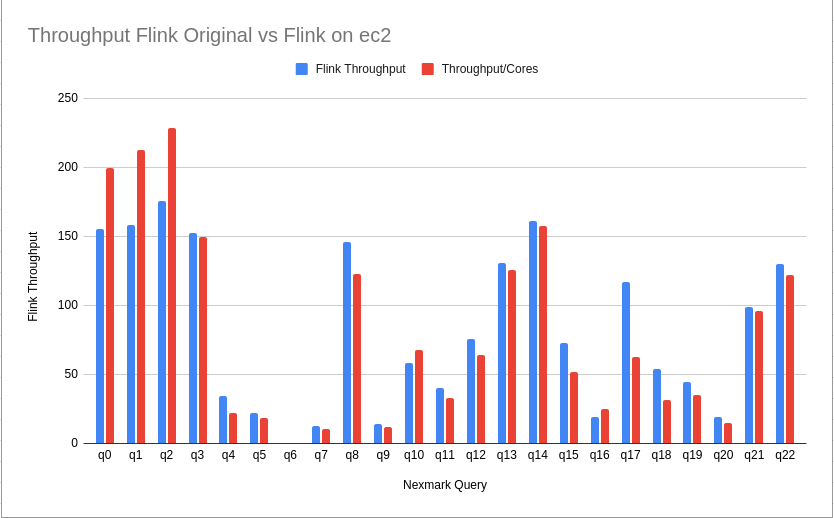
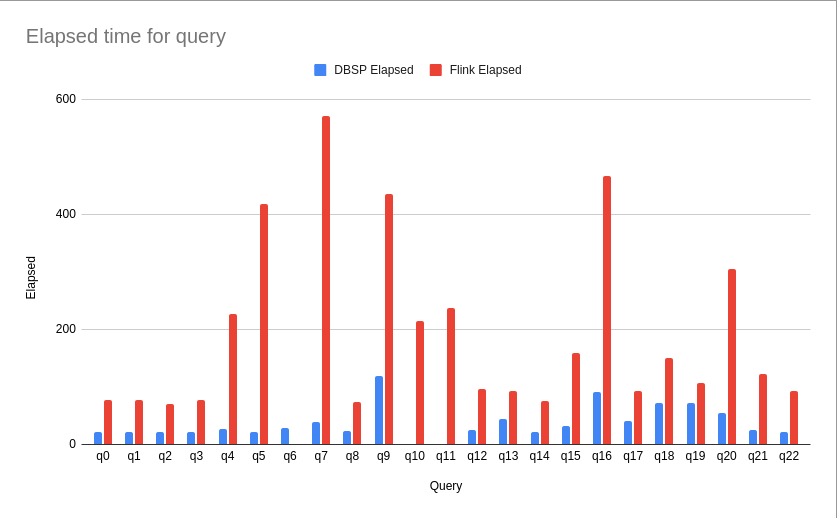
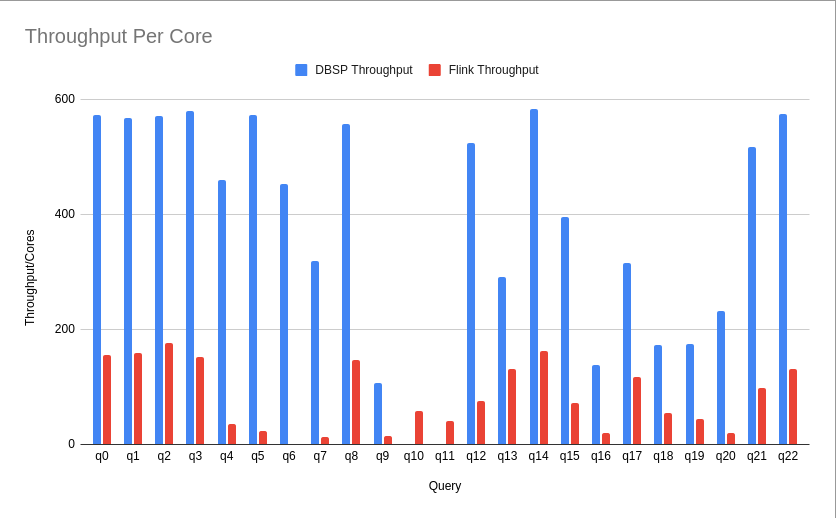

# Automated setup for running Nexmark Flink and DBSP benchmarks

The [Flink playbook](./playbook_flink.yaml) is based on the cluster setup instructions found in the [Nexmark Flink repository](https://github.com/nexmark/nexmark#setup-cluster).

The [DBSP playbook](./playbook_dbsp.yaml) simply allows running the Nexmark queries with DBSP on a similar machine to be able to compare the Flink vs DBSP Nexmark benchmark on the same spec'd machine.

## Install Ansible and dependencies

The `community.crypto` collection is needed to generate an ssh key for the Flink leader to communicate with the workers. The `ansible.posix` collection is used to add the public key of the leader to the workers' `authorized_keys`.

```shell
sudo apt install -y ansible
ansible-galaxy collection install community.crypto ansible.posix
```

## Configuring Ansible with your benchmark machines

Copy the relevant inventory template, for example, for flink:

```shell
cp inventory_flink_temeplate.ini inventory_flink.ini
```

and edit the IP addresses to match the machines you have ready for the roles of your Flink leader and workers, ensuring the `ansible_user` is also correctly set (and potentially the `ansible_ssh_private_key` attribute for ec2 - see appendix below).

Once set, you can run the following to ensure ansible can connect to the machines listed in the inventory:

```shell
$ ansible -i inventory_flink.ini all -m ping
10.147.199.20 | SUCCESS => {
    "ansible_facts": {
        "discovered_interpreter_python": "/usr/bin/python3"
    },
    "changed": false,
    "ping": "pong"
}
10.147.199.24 | SUCCESS => {
    "ansible_facts": {
        "discovered_interpreter_python": "/usr/bin/python3"
    },
    "changed": false,
    "ping": "pong"
}
10.147.199.150 | SUCCESS => {
    "ansible_facts": {
        "discovered_interpreter_python": "/usr/bin/python3"
    },
    "changed": false,
    "ping": "pong"
}
```

## Nexmark Flink benchmark

### Running the playbook to setup the Nexmark-Flink cluster

Note: This playbook assumes your machines are Ubuntu 20.04 instances.

```shell
ansible-playbook -i inventory_flink.ini playbook_flink.yaml
```

### Running the benchmark

Once the Nexmark-Flink cluster is configured, we can `ssh` to the leader and start the cluster (not automated yet, as requires accepting host authenticity of workers on leader):

```shell
ssh -i ~/.ssh/nexmark-bench.pem ubuntu@x.x.x.x
./flink/bin/start-cluster.sh && ./nexmark/bin/setup_cluster.sh
```

and run queries with:

```shell
./nexmark/bin/run_query.sh | tee run_query_output.txt
```

To run the full set of queries on a remote machine, it is best to use screen or byobu to ensure that if the connection is interrupted you can reconnect.

### Nexmark Flink Result

The Nexmark Flink benchmark results below are from running with 8 workers using the `m5ad.4xlarge` instance type (64Gb, 16vCPU, 2x300 SSD) configured with more memory than the original test (leading to slightly better performance in some cases).

```shell
+-------------------+-------------------+-------------------+-------------------+-------------------+-------------------+
| Nexmark Query     | Events Num        | Cores             | Time(s)           | Cores * Time(s)   | Throughput/Cores  |
+-------------------+-------------------+-------------------+-------------------+-------------------+-------------------+
|q0                 |100,000,000        |7.08               |70.668             |500.611            |199.75 K/s         |
|q1                 |100,000,000        |2.21               |212.681            |470.793            |212.41 K/s         |
|q2                 |100,000,000        |3.79               |115.704            |437.987            |228.32 K/s         |
|q3                 |100,000,000        |5.48               |122.024            |668.909            |149.5 K/s          |
|q4                 |100,000,000        |13.21              |342.449            |4524.896           |22.1 K/s           |
|q5                 |100,000,000        |10.83              |509.696            |5521.974           |18.11 K/s          |
|q7                 |100,000,000        |13.38              |705.598            |9440.273           |10.59 K/s          |
|q8                 |100,000,000        |3.99               |204.295            |814.796            |122.73 K/s         |
|q9                 |100,000,000        |11.41              |764.327            |8721.988           |11.46 K/s          |
|q10                |100,000,000        |4.95               |300.152            |1485.508           |67.32 K/s          |
|q11                |100,000,000        |10.06              |302.461            |3042.496           |32.87 K/s          |
|q12                |100,000,000        |5.66               |275.785            |1562.132           |64.02 K/s          |
|q13                |100,000,000        |6.55               |121.440            |795.260            |125.75 K/s         |
|q14                |100,000,000        |5.58               |113.870            |635.684            |157.31 K/s         |
|q15                |100,000,000        |1.76               |1108.881           |1949.250           |51.3 K/s           |
|q16                |100,000,000        |8.09               |492.789            |3985.733           |25.09 K/s          |
|q17                |100,000,000        |9.16               |174.633            |1600.346           |62.49 K/s          |
|q18                |100,000,000        |10.46              |302.273            |3162.283           |31.62 K/s          |
|q19                |100,000,000        |14.12              |201.026            |2837.987           |35.24 K/s          |
|q20                |100,000,000        |15.3               |445.185            |6809.967           |14.68 K/s          |
|q21                |100,000,000        |5.99               |173.613            |1040.571           |96.1 K/s           |
|q22                |100,000,000        |5.84               |140.740            |821.984            |121.66 K/s         |
|Total              |2,200,000,000      |174.915            |7200.290           |60831.429          |1.86 M/s           |
+-------------------+-------------------+-------------------+-------------------+-------------------+-------------------+
```

Although the `Cores` and `Time(s)` columns appear different from the [original Nexmark results](https://github.com/nexmark/nexmark#benchmark-results), the `Cores * Time(s)` and `Throughput/Cores` columns match much more closely. I am not certain, but the reason appears to be that often a query is finished (CPU drops to near zero) but the Flink job does not finish for a substantial time afterwards.

For example, the `q0` query is slightly faster than the original result, and the end of the query is recognized just as the CPU usage drops:

```shell
Start to run query q0 with workload [tps=10 M, eventsNum=100 M, percentage=bid:46,auction:3,person:1,kafkaServers:null]
Start the warmup for at most 120000ms and 100000000 events.
Stop the warmup, cost 120100ms.
Monitor metrics after 10 seconds.
Start to monitor metrics until job is finished.
Current Cores=8.12 (8 TMs)
Current Cores=8.16 (8 TMs)
Current Cores=8.09 (8 TMs)
Current Cores=8.15 (8 TMs)
Current Cores=8.08 (8 TMs)
Current Cores=8.17 (8 TMs)
Current Cores=8.07 (8 TMs)
Current Cores=8.14 (8 TMs)
Current Cores=8.07 (8 TMs)
Current Cores=8.07 (8 TMs)
Current Cores=3.78 (8 TMs)
Current Cores=0.1 (8 TMs)
Summary Average: EventsNum=100,000,000, Cores=7.08, Time=70.668 s
Stop job query q0
```

whereas the `q1` query result is reported as 212s compared to the original Nexmark 76s, yet checking the output, you can see that the CPU usage drops to zero at around one third of the test output, implying either that the query had finished at around 70s, (or there was some tiny remainder that was played out very slowly?). But none-the-less, the `Cores * Time (s)` and `Throughput/Core` columns match the original results (with a slight improvement, just like the `q0` result).

```shell
Start to run query q1 with workload [tps=10 M, eventsNum=100 M, percentage=bid:46,auction:3,person:1,kafkaServers:null]
Start the warmup for at most 120000ms and 100000000 events.
Stop the warmup, cost 120100ms.
Monitor metrics after 10 seconds.
Start to monitor metrics until job is finished.
Current Cores=8.1 (8 TMs)
Current Cores=8.14 (8 TMs)
Current Cores=8.09 (8 TMs)
Current Cores=8.14 (8 TMs)
Current Cores=8.08 (8 TMs)
Current Cores=8.13 (8 TMs)
Current Cores=8.08 (8 TMs)
Current Cores=8.09 (8 TMs)
Current Cores=8.07 (8 TMs)
Current Cores=8.09 (8 TMs)
Current Cores=6.4 (8 TMs)
Current Cores=1.15 (8 TMs)
Current Cores=0.05 (8 TMs)
Current Cores=0.17 (8 TMs)
Current Cores=0.16 (8 TMs)
Current Cores=0.28 (8 TMs)
Current Cores=0.04 (8 TMs)
Current Cores=0.06 (8 TMs)
Current Cores=0.04 (8 TMs)
Current Cores=0.08 (8 TMs)
Current Cores=0.05 (8 TMs)
Current Cores=0.07 (8 TMs)
Current Cores=0.05 (8 TMs)
Current Cores=0.07 (8 TMs)
Current Cores=0.04 (8 TMs)
Current Cores=0.07 (8 TMs)
Current Cores=0.06 (8 TMs)
Current Cores=0.08 (8 TMs)
Current Cores=0.04 (8 TMs)
Current Cores=0.07 (8 TMs)
Current Cores=0.04 (8 TMs)
Current Cores=0.07 (8 TMs)
Current Cores=0.05 (8 TMs)
Current Cores=0.11 (8 TMs)
Current Cores=0.07 (8 TMs)
Current Cores=0.09 (8 TMs)
Current Cores=0.04 (8 TMs)
Current Cores=0.08 (8 TMs)
Current Cores=0.04 (8 TMs)
Current Cores=0.06 (8 TMs)
Current Cores=0.04 (8 TMs)
Summary Average: EventsNum=100,000,000, Cores=2.21, Time=212.681 s
Stop job query q1
```

See the [complete output for all queries](logs/nexmark-flink-full-output.txt) to compare other queries.

As a comparison, the following chart shows the throughput of the original Nexmark results vs those found on the `m5ad.4xlarge` workers here:



## DBSP Nexmark Benchmark

### Running the playbook to setup the DBSP machine

Note: This playbook assumes your machines are Ubuntu 20.04 instances.

```shell
ansible-playbook -i inventory_dbsp.ini playbook_dbsp.yaml
```

### Running the benchmark

Once the machine is configured, we can build and run the benchmark by ssh'ing into the machine and running:

```shell
./dbsp-bench.sh
```

### DBSP Result

The Nexmark DBSP benchmark results below are from running the queries on a single worker `m5ad.4xlarge` instance type (64Gb, 16vCPU, 2x300 SSD), configured with 8 workers (passed to [`Runtime::init_circuit()`](https://github.com/vmware/database-stream-processor/blob/dc1f6420cce5fd7de56e99a3655015ef55c80753/src/circuit/dbsp_handle.rs#L9-L30)) to be similar in parallelism to the Nexmark Flink tests.

```shell
┌───────┬─────────────┬───────┬──────────┬─────────────────┬──────────────────┬───────────────┬───────────────┬─────────────┬────────────┬────────────────┬─────────────┬─────────────┐
│ Query │ #Events     │ Cores │ Elapsed  │ Cores * Elapsed │ Throughput/Cores │ Total Usr CPU │ Total Sys CPU │ Current RSS │ Peak RSS   │ Current Commit │ Peak Commit │ Page Faults │
├───────┼─────────────┼───────┼──────────┼─────────────────┼──────────────────┼───────────────┼───────────────┼─────────────┼────────────┼────────────────┼─────────────┼─────────────┤
│ q0    │ 100,000,000 │ 8     │ 21.812s  │ 174.494s        │ 573.087 K/s      │ 225.377s      │ 2.231s        │ 464.79 MiB  │ 169.29 MiB │ 464.79 MiB     │ 464.82 MiB  │ 0           │
│ q1    │ 100,000,000 │ 8     │ 21.999s  │ 175.989s        │ 568.218 K/s      │ 250.729s      │ 2.078s        │ 4.65 MiB    │ 238.05 MiB │ 4.65 MiB       │ 4.68 MiB    │ 0           │
│ q2    │ 100,000,000 │ 8     │ 21.900s  │ 175.200s        │ 570.775 K/s      │ 229.380s      │ 1.917s        │ 5.53 MiB    │ 255.69 MiB │ 5.53 MiB       │ 5.57 MiB    │ 0           │
│ q3    │ 100,000,000 │ 8     │ 21.557s  │ 172.455s        │ 579.860 K/s      │ 233.683s      │ 2.693s        │ 264.09 MiB  │ 508.00 MiB │ 264.09 MiB     │ 264.12 MiB  │ 1           │
│ q4    │ 100,000,000 │ 8     │ 27.180s  │ 217.443s        │ 459.891 K/s      │ 301.086s      │ 9.212s        │ 4.51 GiB    │ 7.72 GiB   │ 4.51 GiB       │ 7.33 GiB    │ 0           │
│ q5    │ 100,000,000 │ 8     │ 21.848s  │ 174.783s        │ 572.136 K/s      │ 234.388s      │ 3.990s        │ 1.16 MiB    │ 7.72 GiB   │ 1.16 MiB       │ 1.19 MiB    │ 0           │
│ q6    │ 100,000,000 │ 8     │ 27.666s  │ 221.332s        │ 451.810 K/s      │ 315.526s      │ 7.183s        │ 1.01 GiB    │ 8.71 GiB   │ 1.01 GiB       │ 3.83 GiB    │ 0           │
│ q7    │ 100,000,000 │ 8     │ 39.318s  │ 314.543s        │ 317.922 K/s      │ 280.992s      │ 9.446s        │ 3.50 GiB    │ 12.74 GiB  │ 3.50 GiB       │ 6.94 GiB    │ 0           │
│ q8    │ 100,000,000 │ 8     │ 22.452s  │ 179.612s        │ 556.755 K/s      │ 237.667s      │ 3.432s        │ 4.59 MiB    │ 12.74 GiB  │ 4.59 MiB       │ 4.67 MiB    │ 0           │
│ q9    │ 100,000,000 │ 8     │ 118.166s │ 945.325s        │ 105.784 K/s      │ 575.137s      │ 18.756s       │ 6.26 GiB    │ 22.00 GiB  │ 6.26 GiB       │ 12.66 GiB   │ 0           │
│ q12   │ 100,000,000 │ 8     │ 23.843s  │ 190.748s        │ 524.253 K/s      │ 254.199s      │ 2.574s        │ 7.54 MiB    │ 22.00 GiB  │ 7.54 MiB       │ 7.61 MiB    │ 0           │
│ q13   │ 100,000,000 │ 8     │ 42.980s  │ 343.839s        │ 290.834 K/s      │ 369.807s      │ 8.485s        │ 3.97 MiB    │ 22.00 GiB  │ 3.97 MiB       │ 5.33 GiB    │ 0           │
│ q14   │ 100,000,000 │ 8     │ 21.432s  │ 171.453s        │ 583.252 K/s      │ 243.556s      │ 1.723s        │ 992.00 KiB  │ 22.00 GiB  │ 992.00 KiB     │ 1.00 MiB    │ 0           │
│ q15   │ 100,000,000 │ 8     │ 31.684s  │ 253.472s        │ 394.522 K/s      │ 314.417s      │ 13.755s       │ 6.65 MiB    │ 22.00 GiB  │ 6.65 MiB       │ 6.72 MiB    │ 0           │
│ q16   │ 100,000,000 │ 8     │ 91.241s  │ 729.925s        │ 137.000 K/s      │ 740.327s      │ 11.651s       │ 6.72 MiB    │ 22.00 GiB  │ 6.72 MiB       │ 6.79 MiB    │ 0           │
│ q17   │ 100,000,000 │ 8     │ 39.603s  │ 316.822s        │ 315.635 K/s      │ 430.137s      │ 9.622s        │ 2.25 GiB    │ 22.00 GiB  │ 2.25 GiB       │ 3.56 GiB    │ 0           │
│ q18   │ 100,000,000 │ 8     │ 72.267s  │ 578.134s        │ 172.970 K/s      │ 433.556s      │ 12.617s       │ 16.00 EiB   │ 24.34 GiB  │ 16.00 EiB      │ 6.46 GiB    │ 0           │
│ q19   │ 100,000,000 │ 8     │ 71.625s  │ 573.003s        │ 174.519 K/s      │ 533.640s      │ 25.065s       │ 16.00 EiB   │ 26.10 GiB  │ 16.00 EiB      │ 8.09 GiB    │ 0           │
│ q20   │ 100,000,000 │ 8     │ 53.933s  │ 431.467s        │ 231.768 K/s      │ 403.149s      │ 13.237s       │ 16.00 EiB   │ 26.10 GiB  │ 16.00 EiB      │ 7.19 GiB    │ 0           │
│ q21   │ 100,000,000 │ 8     │ 24.141s  │ 193.128s        │ 517.791 K/s      │ 253.392s      │ 2.063s        │ 16.00 EiB   │ 26.10 GiB  │ 16.00 EiB      │ 44.00 KiB   │ 0           │
│ q22   │ 100,000,000 │ 8     │ 21.734s  │ 173.875s        │ 575.125 K/s      │ 252.337s      │ 2.015s        │ 16.00 EiB   │ 26.10 GiB  │ 16.00 EiB      │ 40.00 KiB   │ 0           │
└───────┴─────────────┴───────┴──────────┴─────────────────┴──────────────────┴───────────────┴───────────────┴─────────────┴────────────┴────────────────┴─────────────┴─────────────┘
```

## Comparison of DBSP vs Flink for Nexmark benchmark

The comparison charts below compare the DBSP benchmark recorded above with the original Nexmark-Flink results, due to the issue outlined above where the query is complet (CPU goes to zero) before Flink completes the task (see above for chart comparing throughput).





You can [view and/or copy the sheet with the data and graphs](https://docs.google.com/spreadsheets/d/1CQmbgwgUjNVaCoLQkNMzWEuW_cfYbpiuoq1PE12-b9U/edit?usp=sharing).

## Appendix 1: Setting up ec2 instances for running benchmarks

To create your leader and worker instances, first create an ssh key-pair for use with the benchmarking instances:

```shell
aws ec2 create-key-pair \
    --key-name nexmark-bench \
    --key-type rsa \
    --key-format pem \
    --query "KeyMaterial" \
    --output text > $HOME/.ssh/nexmark-bench.pem
chmod 400 $HOME/.ssh/nexmark-bench.pem
```

Then create nine (8 workers, as per the nexmark conf) `m5ad.4xlarge` instances (64Gb, 16vCPU, 2x300 SSD) with an Ubuntu 20.04 LTS OS, with the keypair created above ready for ssh access. The default image has only 8Gb for the root partition, so update that to use the full 600Gb.

```shell
aws ec2 run-instances --image-id ami-0c1704bac156af62c --count 9 --instance-type m5ad.4xlarge --key-name nexmark-bench --block-device-mappings '{"DeviceName": "/dev/sda1", "Ebs": { "VolumeSize": 600 } }'
```

Ensure that your public IP address (the ansible host) is allowed to access port 22 of your servers. For example:

```shell
aws ec2 authorize-security-group-ingress --group-id sg-0ef693a5bacbce0e1 --protocol tcp --port 22 --cidr x.x.x.x/32
```

You can verify this works by doing running `ssh-keyscan -H x.x.x.x` which should return the expected keys. Once verified, add the keys to your known hosts with:

```shell
for IP in $(aws ec2 describe-instances --query "Reservations[*].Instances[*].PublicIpAddress" --output text)
do
    ssh-keyscan -H $IP >> ~/.ssh/known_hosts
done
```

Note that you'll need to specify the key when using ssh with:

```shell
ssh -i ~/.ssh/nexmark-bench.pem ubuntu@x.x.x.x
```

as well as in the ansible inventory file, for example:

```ini
leader ansible_host=x.x.x.x ansible_user=ubuntu ansible_ssh_private_key_file=/home/username/.ssh/nexmark-bench.pem
...
```

## Appendix 2: Setting up local VMs for testing the nexmark setup

Although you won't be able to run the Nexmark Flink benchmark locally on a set of Ubuntu VMs, you can test the playbooks locally if you need to update them. To do so, [install multipass](https://multipass.run/install) and run 3 Ubuntu VMs configured with your public SSH key, with:

```shell
for VM in nexmark-leader nexmark-worker1 nexmark-worker2
do
    multipass launch 20.04 --name ${VM} --cpus 2 --mem 2G
    cat ~/.ssh/id_rsa.pub | multipass transfer - ${VM}:/tmp/host_id_rsa.pub
    multipass exec ${VM} -- sh -c 'cat /tmp/host_id_rsa.pub >> /home/ubuntu/.ssh/authorized_keys'
done
```

This should leave you with three VMs, each with their own IP address:

```shell
$ multipass list
Name                    State             IPv4             Image
nexmark-leader          Running           10.147.199.36    Ubuntu 22.04 LTS
nexmark-worker1         Running           10.147.199.193   Ubuntu 22.04 LTS
nexmark-worker2         Running           10.147.199.72    Ubuntu 22.04 LTS
```

Verify that you can `ssh ubuntu@...` for each and you're ready to go.

When you are later finished and want to remove the VMs:

```shell
for VM in nexmark-leader nexmark-worker1 nexmark-worker2
do
    multipass delete ${VM}
done
multipass purge
```
